# 多时间点目标函数的伴随瞬态灵敏度分析

前面补充文字。。。。

## 二、背景

### 瞬态分析

文章中：

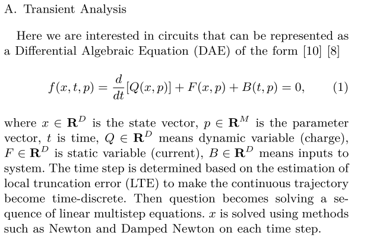

参考【10】使用：

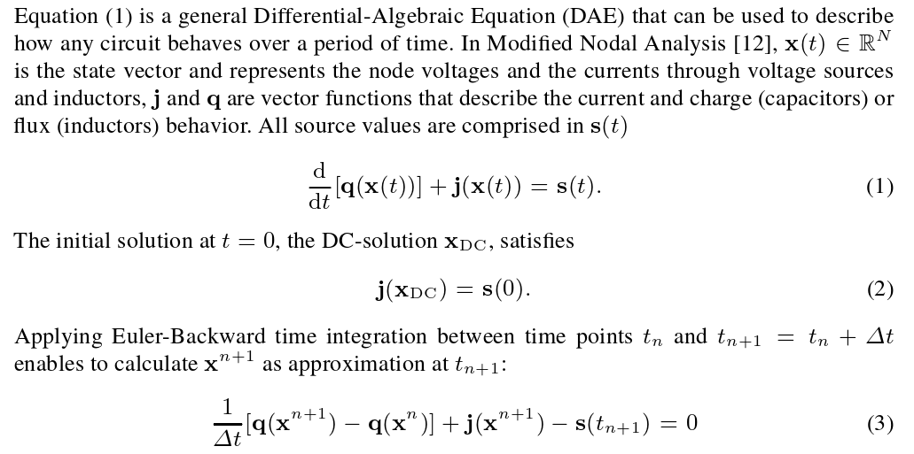

### 瞬态敏感度分析

（1）求导：

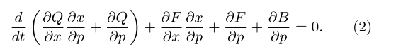

利用x在$t_{n+1}$处的近似离散化：

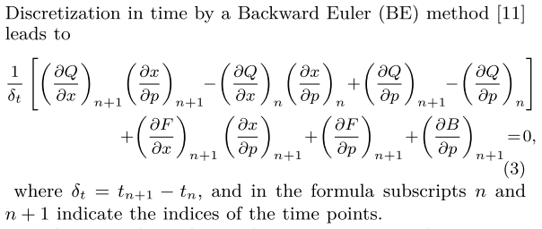

交换顺序，提取与x不相干项，基于迭代关系，两种方法，向前和向后传播。

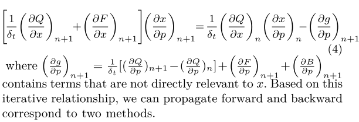

目标函数数量远大于参数数量，直接法合适，相当于神经网络的前向传播：

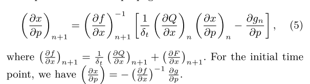

上面为正向迭代，假设目标函数是$X_N$函数，瞬态灵敏度通过

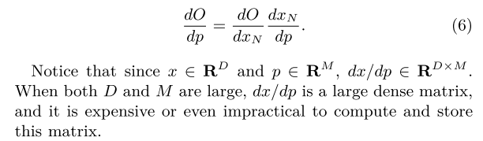

D和M比较大的时候，伴随法比较适合，类似向后传播：

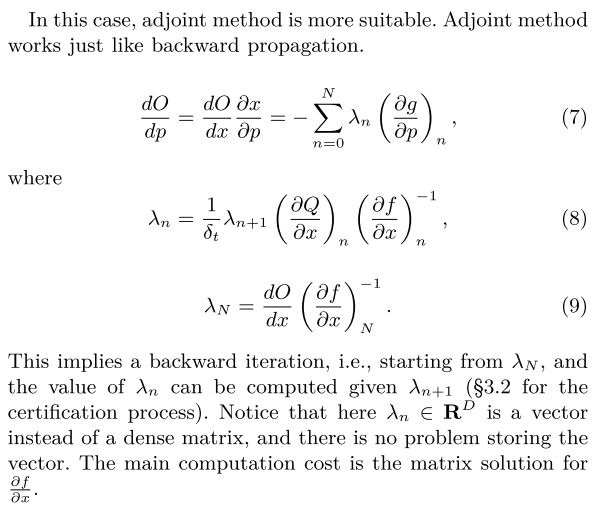

## 三、多时间灵敏度

所有时间点目标函数的灵敏度：

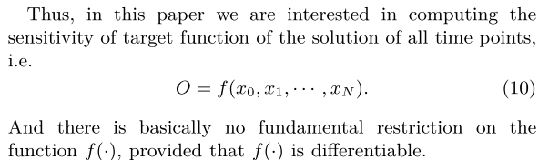

对（10）链规则：

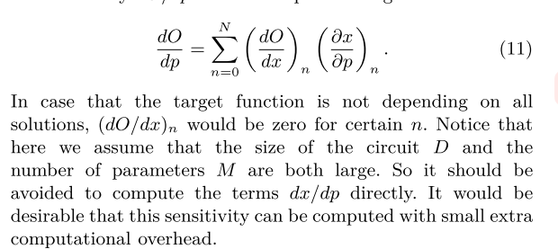

重写（5）：

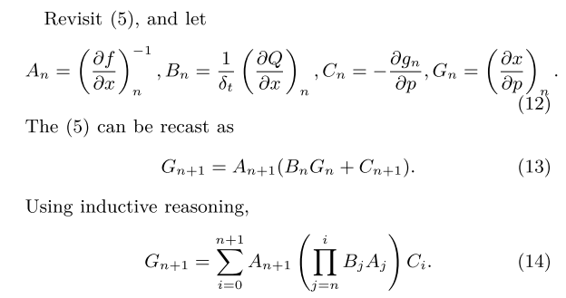

从（11）的单项，考虑如下：

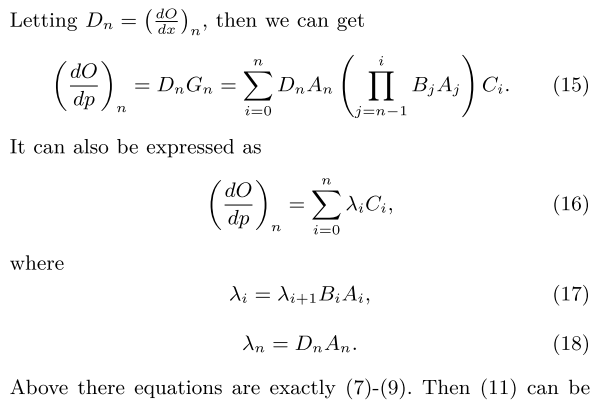

（11）可以被改写成：

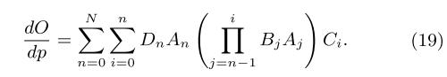

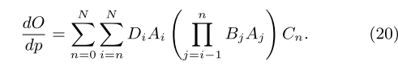

也可以改写成（16）的形式：

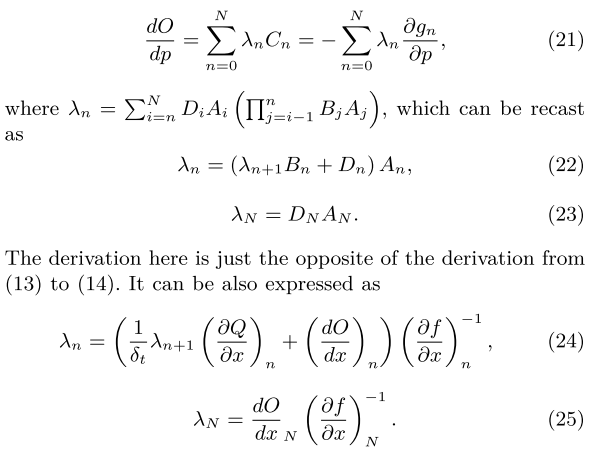

(21) 的计算复杂度为0 (N)，与原来相比大大降低。

## 四、时频转换

本节中，我们重点计算对于涉及时频转换的目标函数，如THD、SNDR和SFDR。

傅里叶分析的典型过程包括以下步骤[12]:

​		1)将积分分解为积分和，每个时间步一个；

​		2)采用三次样条插值，用分段多项式逼近波形，得到多项式系数c;

​		3)分析计算每个时间步长的傅里叶积分;

​		4)对各阶、各时间步的积分求和，得到频率谐波

在获得谐波之后，性能指标可以通过以下方式：

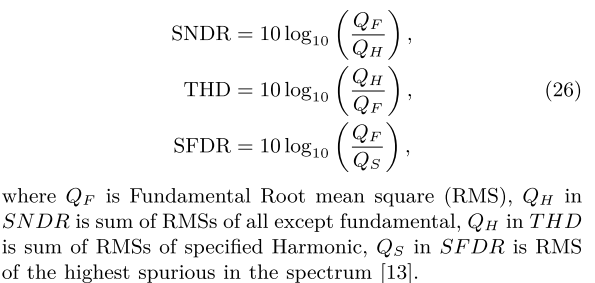

进行有效的伴随瞬态灵敏度分析的关键不仅在于计算时频转换，而且在于计算其反向梯度传播。

### 总体算法

反向传播可以通过组合（35）、（43）和（45）来计算，总结了SNDR, THD, SFDR等瞬态灵敏度分析的框架。

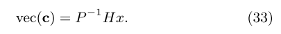

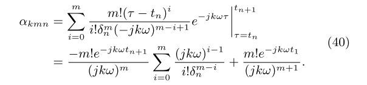

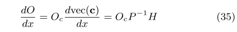

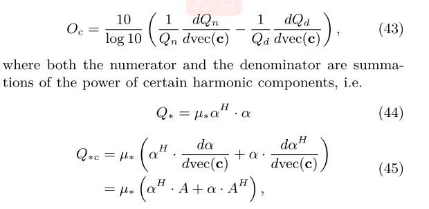

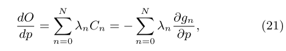

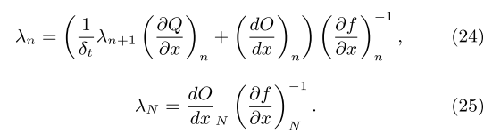

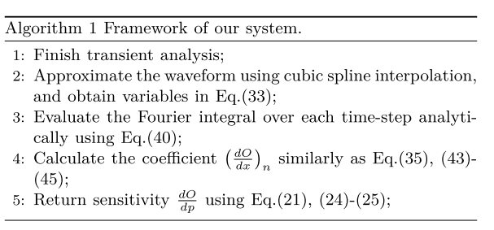

## 五、实验结果

## 六、结论

。。。补充

